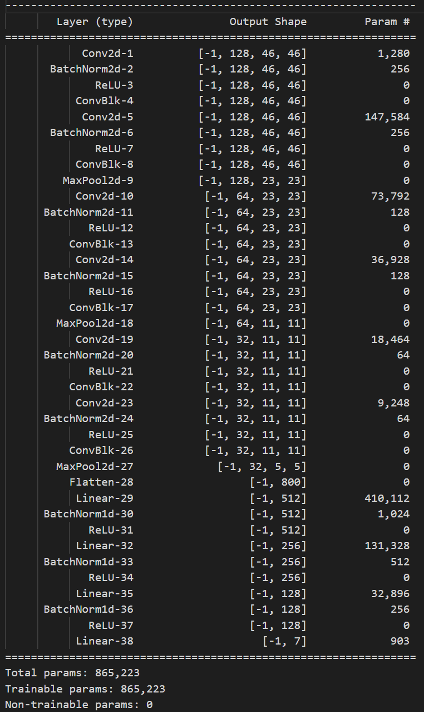
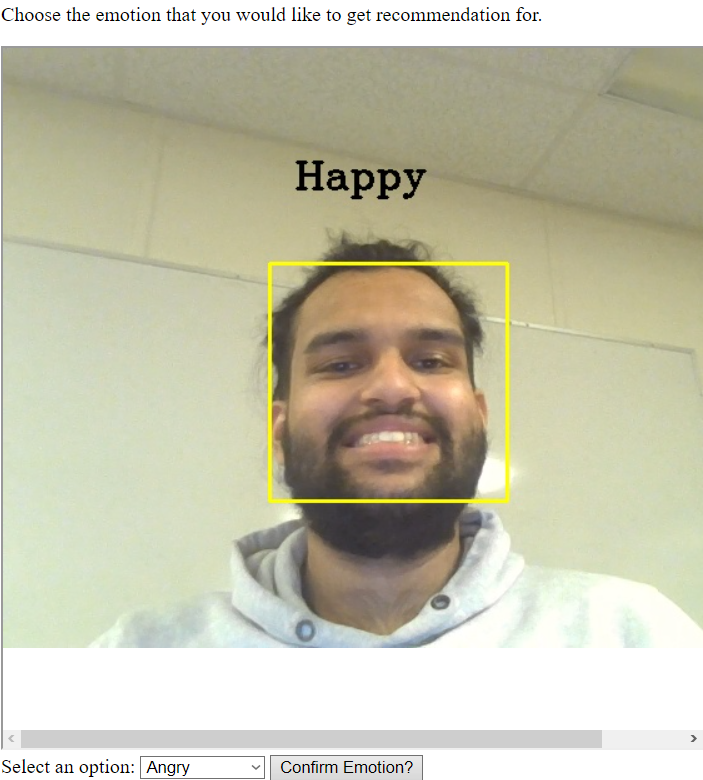
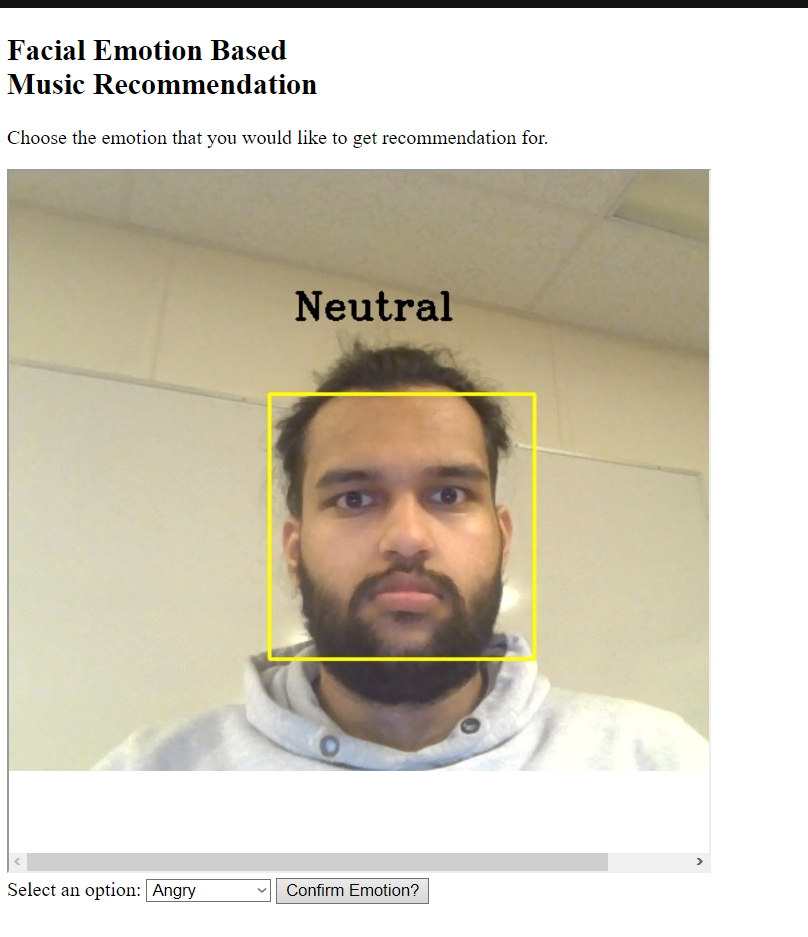
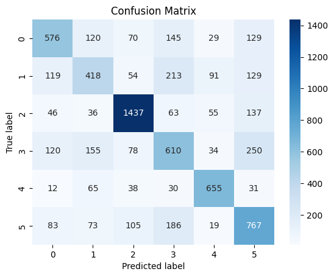
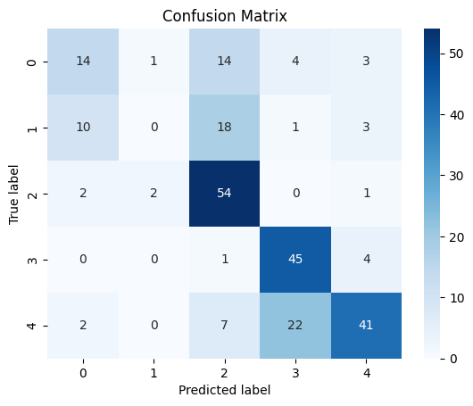
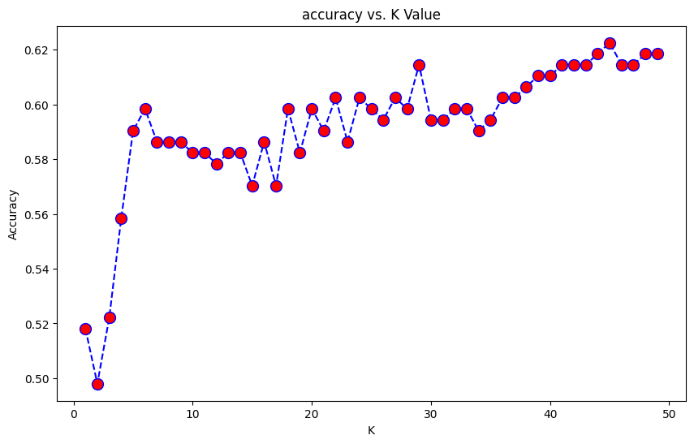
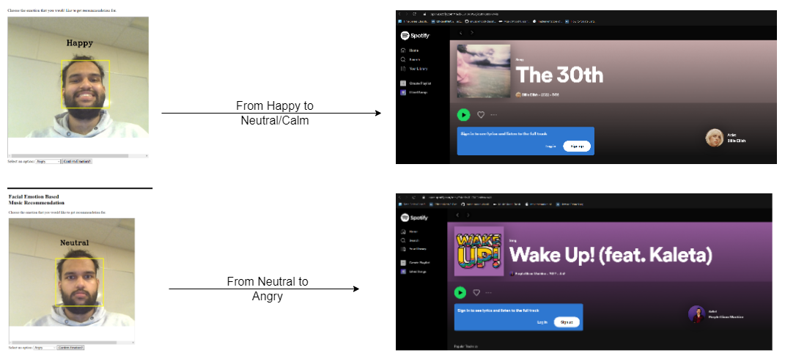

# Music-Recommendation
A music recommendation system derived from facial emotions. Consists of a facial emotion detector constructed using a neural network and a recommendation system built using filtering methods.

## Introduction
This project is a facial emotion recognition project that uses deep learning techniques to recognize human emotions from facial expressions and use those emotions to generate accurate song recommendations. This project is split into two phases:
1. Facial Emotion Recognition: Accurately identify the seven basic emotions such as happiness, sadness, anger, fear, disgust, and surprise and neutral (calm) from facial images in real time.
2. Music Recommendation: Recommend songs from the Spotify API using the results of the facial emotion detection system.

## Dataset
The dataset used for the facial emotion Recognition task is the [FER2013](https://www.kaggle.com/c/challenges-in-representation-learning-facial-expression-recognition-challenge/data) dataset. It consists of 35,887 grayscale images of size 48x48 pixels, with each image labeled with one of seven emotions: anger, disgust, fear, happiness, sadness, surprise, and neutral. 
For the task of music recommendation, playlists were scrapped from the [Spotify Web-API](https://developer.spotify.com/documentation/web-api/).

## Architecture
For the task of Facial Emotion Recongition, a simple Convolutional Neural Network is constructed. The convolutional Neural Networks consists of six convolutional blocks. Each block is made up of a sequence of a convolutional layer, followed by Batchnorm and ReLU activation function. There is also a three layer MLP that makes up the classification section of the neural network. The architecture is shown in the figure below: 

## Implementation
To run the code, ensure that Flask is installed on your system. Flask can be installed by simply running the following command:
  !pip install -U Flask
Once Flask is installed, simply run app.py, then navigate to localhost:8000 and provide webcam access.

## Results and Discussion
Facial Emotion Recognition
The results of the FER system are a class label that best represents the user's current emotional state. An interactive User Interface is generated using Flask, basic HTML/CSS and JavaScript. The UI presents an option for user's to give access to their camera and for the model to detect the bounding box of their face and generate their emotional state frame by frame in real time. Sample predictions made by the model are below:

The model was evaluated on metrics such as Accuracy, Precision and Recall. A heatmap of the confusion matrix was also generated for better understanding of what the model is able to predict efficiently. The FER model achieves an accuracy of 62.17%, a precision of 62.2% and a recall of 61.15%. The heatmaps are shown below:
 

The heatmap above details the predicted vs ground truth labels for the emotion detection, whereas the heatmap below details the predicted vs ground truth labels for the music recommendation system.

As the number of samples for the disgusted class label is very low and because it is very difficult to sample music that accurately represents songs that induce a complex emotion like disgust, the disgust class was combined with anger to form a single class.

### Music Recommmendation System
The music recommendation section was done by first scrapping songs from spotify. The playlists chosen to be scrapped are those that have atleast one of the class labels in the playlist titles. The playlists scrapped consist of the name of the artist, the album, the name of the track and individual features that each track posses such as Valence, Tempo, Energy and Loudness. The audio features are then normalized to make clustering uniform. Based on the clusters generated by using the supervised K-Nearest Neighbors algorithm, a song that best represents the specific emotion label is recommended. This is done by finding the mean of the cluster and finding the datapoint in the cluster closest to that mean. The UI provides an option for users to generate an URL that redirects them to the song on Spotify. It also allows user's to decide which emotion they would like to recieve recommendations for.
The music recommendation system was also evaluated on accuracy. Using the K-Nearest Neighbours algorithm it produced an accuracy of 62.24% at k=44.  the graph of accuracies for each value of k is generated below:
 
The results produced are detailed below:

